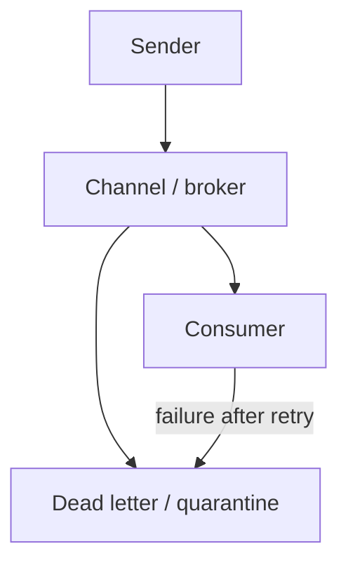

# Focus fixture: Sender / DLQ routing

```mermaid
flowchart TD
    S[Sender] --> Q[Channel / broker]
    Q --> C[Consumer]
    Q --> DL[Dead letter / quarantine]
    C -->|failure after retry| DL
```

