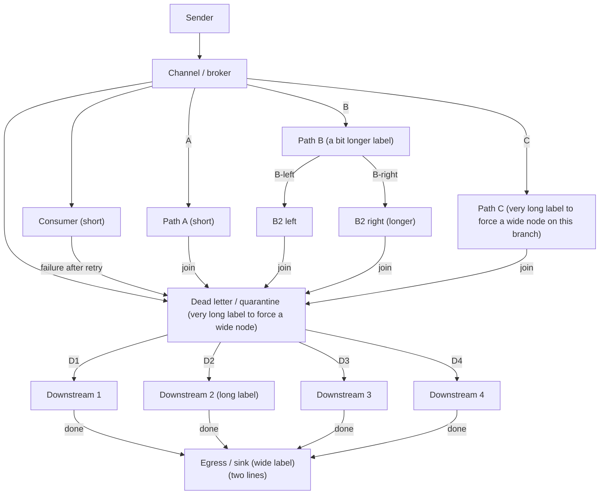

# Symmetry stress fixture (single diagram)

```mermaid
flowchart TD
    %% Level 0 (core hub + sink)
    S[Sender] --> Q[Channel / broker]
    Q --> C["Consumer (short)"]
    Q --> DL["Dead letter / quarantine (very long label to force a wide node)"]
    C -->|failure after retry| DL

    %% Level 1: 1→3 fan-out from the hub (expect symmetric columns)
    Q -->|A| A1["Path A (short)"]
    Q -->|B| B1["Path B (a bit longer label)"]
    Q -->|C| C1["Path C (very long label to force a wide node on this branch)"]

    %% Level 2: 1→2 fan-out on one branch
    B1 -->|B-left| B2L["B2 left"]
    B1 -->|B-right| B2R["B2 right (longer)"]

    %% Level 3: 4→1 fan-in (join) into the shared sink
    A1 -->|join| DL
    B2L -->|join| DL
    B2R -->|join| DL
    C1 -->|join| DL

    %% Level 4: 1→4 fan-out from the shared sink (stress 4-way columns)
    DL -->|D1| D1["Downstream 1"]
    DL -->|D2| D2["Downstream 2 (long label)"]
    DL -->|D3| D3["Downstream 3"]
    DL -->|D4| D4["Downstream 4"]

    %% Level 5: 4→1 fan-in (final join)
    D1 -->|done| OUT["Egress / sink (wide label)\n(two lines)"]
    D2 -->|done| OUT
    D3 -->|done| OUT
    D4 -->|done| OUT
```

